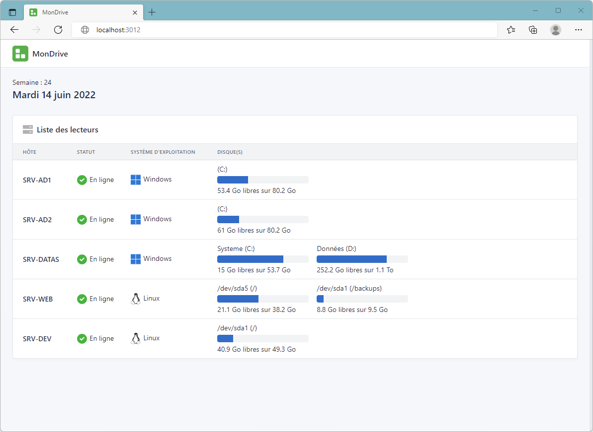

<div align="center">
	
	<h1>MonDrive</h1>
	<br/>
	
	
	<br/><br/>
</div>

Afficher les lecteurs locaux d'une liste de serveur Windows



## Installation

### Prérequis

- Windows 2012 où supérieur
- Navigateur web moderne par défault
- Autoriser l'exécution des scripts PowerShell (`Set-ExecutionPolicy Unrestricted -Force`)

Lancer la commande PowerShell suivante:

```powershell
[Net.ServicePointManager]::SecurityProtocol = [Net.SecurityProtocolType]::Tls12 ; iwr -useb https://raw.githubusercontent.com/Fl0wyn/MonDrive/master/scripts/install.ps1 | iex
```

## Configuration

Editer le fichier **ListMonDrive.txt** dans `C:\Exploitation`

## Exécution

Lancer l'applcation  **MonDrive.exe** présent sur le bureau

## Désinstallation

Supprimer l'éxécutable **C:\Windows\Temp\MonDrive-Update.exe**

Supprimer le dossier **C:\Exploitation\MonDrive** et l'icône sur le bureau

Arrêter le serveur web si le dossier est en cours d'utilisation

```powershell
Stop-Process -Force -Name "tiny"
```

## Ressources

- [Tabler](https://tabler.io/)
- [Font Awesome](https://fontawesome.com)
- [TinyWeb](https://www.ritlabs.com/en/products/tinyweb/)
- [PS2EXE](https://github.com/MScholtes/PS2EXE)
